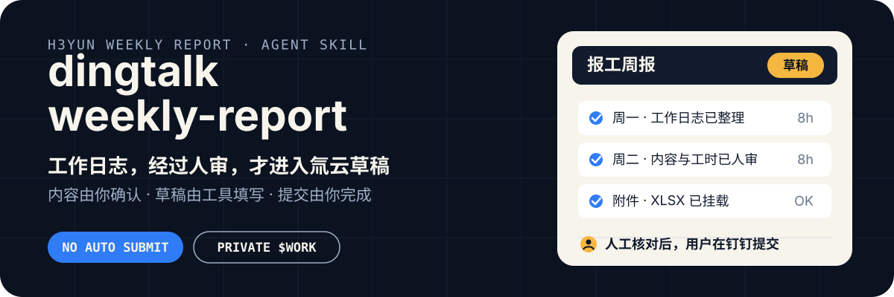
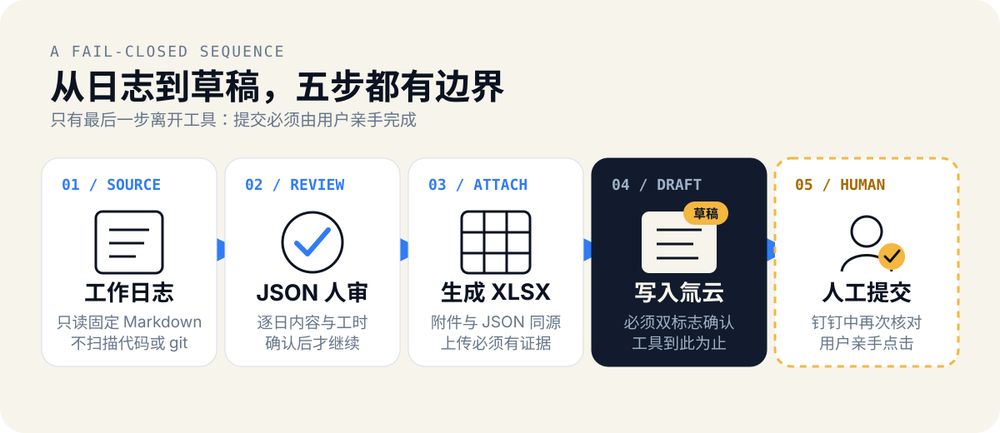

<p align="center">
  
</p>

<p align="center">
  <a href="#快速开始">快速开始</a> ·
  <a href="#安全与适用边界">安全边界</a> ·
  <a href="./skills/dingtalk-weekly-report/USER_GUIDE.md">完整指南</a> ·
  <a href="#文档与发布">文档与发布</a>
</p>

`dingtalk-weekly-report` 是面向 Claude Code / Codex 的半自动 Skill：
从个人工作日志生成周报 JSON 与 XLSX，经用户审核后填写到氚云 H3yun **草稿**。
工具没有提交能力，最终提交始终由用户在钉钉中亲手完成。

> [skills.sh](https://skills.sh/dff652/dingtalk-weekly-report/dingtalk-weekly-report) ·
> [v0.3.0 Release](https://github.com/dff652/dingtalk-weekly-report/releases/tag/v0.3.0) ·
> [Apache-2.0](LICENSE) · Copyright 2026 dff652

## 它守住的三条边界

- **只落草稿**：脚本不存在提交路径；落草稿必须同时提供 `--draft --confirmed`。
- **内容必须人审**：JSON 是审核锚点，逐日内容与工时确认后才能填表。
- **私有数据不进仓库**：表单 URL、字段 ID、枚举、周报和登录态只存每用户私有 `$WORK`。

这些约束由配置校验、代码不变量、公开树扫描、mock e2e 和发行验收共同保护。
完整信任模型见 [SECURITY.md](SECURITY.md)，测试证据见 [docs/TESTING.md](docs/TESTING.md)。

## 工作流

<p align="center">
  
</p>

```text
工作日志 → 周报 JSON（人审）→ XLSX → 氚云草稿 → 用户在钉钉提交
```

缺失内容、非法工时、下拉未精确命中、附件未确认上传，或暂存后没有成功提示时，流程都会中止；
不会用猜测或静默兜底换取“看起来成功”。

## 快速开始

需要 [Node.js](https://nodejs.org/) 和 [uv](https://docs.astral.sh/uv/)。
本项目验收使用的 `skills@1.5.20` 要求 Node.js `>=22.20.0`。

```bash
npx skills add dff652/dingtalk-weekly-report
```

新开 AI 会话后显式调用：

```text
# Claude Code
/dingtalk-weekly-report

# Codex
$dingtalk-weekly-report
```

首次调用会引导运行 bootstrap，建立独立 `$WORK`、Python venv、Chromium 和私有配置；
之后按“内容人审 → 预览 → 落草稿 → 用户提交”完成每周流程。

不知道下一步时，再次显式调用 Skill；Agent 会先解析真实 `$WORK`，再运行
`fill_form.py --status`。纯 CLI 的路径解析与命令见
[使用指南](docs/USER_GUIDE.md)。

确定性安装、Windows、zip 回退、配置、扫码登录、纯 CLI、升级和 FAQ：
见随 Skill 安装的
[USER_GUIDE.md](skills/dingtalk-weekly-report/USER_GUIDE.md)。

## 安全与适用边界

工具使用 Playwright 驱动 Chromium 操作你有权访问的氚云表单。请先确认所在组织允许此类自动化。

| 工具可以做 | 工具不会做 |
|---|---|
| 读取一个明确配置的工作日志文件 | 扫描代码仓库或根据 git log 编造工作内容 |
| 生成 JSON、XLSX 和填表预览 | 自动点击钉钉“提交” |
| 在两道护栏下新建或更新目标周草稿 | 修改已提交记录或绕过唯一性判定 |
| 本机保存登录态与私有配置 | 上传遥测、登录链接或组织配置 |

- 当前真实 DOM 路径只在维护者租户完成过真机验证；其他组织可能需要重新发现字段或适配选择器。
- Windows 有安装和 bootstrap 脚本，但尚未完成 Windows 实机验收。
- `--confirmed` 是操作者完成检查清单的声明，不是身份认证或审计证明。
- 如果组织禁止自动化操作 HR 系统，或你不能接受本地进程持有登录会话，请不要安装。

真实表单截图可能包含租户、人员和周报内容，本仓库不会把它们用作公开演示素材。

## 文档与发布

| 入口 | 用途 |
|---|---|
| [用户指南](skills/dingtalk-weekly-report/USER_GUIDE.md) | 安装、配置、登录、每周使用、CLI、升级与 FAQ |
| [Skill SOP](skills/dingtalk-weekly-report/SKILL.md) | Agent 执行流程与硬规则 |
| [输入输出契约](skills/dingtalk-weekly-report/references/CONTRACT.md) | 缺失处理、产物和失败原则 |
| [安全说明](SECURITY.md) | 信任模型、隐私边界和扫描器告警 |
| [人工验收](docs/MANUAL_ACCEPTANCE.md) | 真实登录、预览、草稿与最终提交 |
| [维护者指南](docs/MAINTAINER.md) | 开发、测试、调试和路线图 |
| [发布说明](docs/PUBLISHING.md) | 版本、打包、分发、回滚和历史脱敏 |
| [CHANGELOG](CHANGELOG.md) / [CONTRIBUTING](CONTRIBUTING.md) | 版本变化与贡献规则 |
